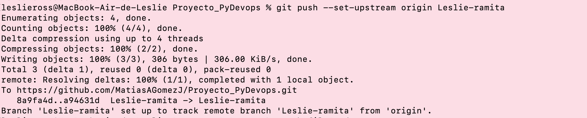

# **Tarea 5** - *Repositorio compartido con mi equipo A*

En esta tarea vamos a simular con mis compañeros que desarrollamos un mismo proyecto en común. 

## **1r paso: CRAEACIÓN DEL PROYECTO**

### Lo primero de todo, un miembro del equipo de desarrolladores (en nuestro caso el seleccionado es Matías), crea desde su Git un proyecto, llamado *Proyecto_PyDevops*, y nos dio acceso a ese proyecto. 
>Luego copiamos el enlace de ese repositorio compartido y usando el comando ***git clone*** lo clonamos en nuestro directorio local, en la ruta de nuestra elección.Y accedemos allí después. 
>>Recordamos que para cambiar de directorio desde la consola usamos el comando ***cd*** y para visualizar el contenido de la carpeta seleccionada, lo hacemos con ***ls***

 

## **2n paso: CREAMOS UNA NUEVA RAMA PERSONAL**

### A continuación creamos una nueva rama para hacer ahí nuestras modificaciones del proyecto, usando el comando ***git branch Leslie-ramita*** y para movernos a esa nueva rama hacemos un ***git checkout***

 

## **3r paso: HACEMOS LAS MODIFICACIONES EN NUESTRA RAMITA**

### En mi caso, he escogido crear 5 archivos markdown (ej: ***touch file1.md***)y editando su contenido con ***vim file1.md***

## **4t paso: PREPARAMOS LOS ARCHIVOS PARA SU SUBIDA**
### Para poder subir los cambios a nuestro repositorio remoto y compartirlo con nuestros compañeros, previamente debemos pasar los archivos al estado *STAGED o "limbo"*, usamos : ***git add*** y luego hacemos ***git commmit -m "el mensaje"*** (esta información es necesaria y útil tanto para nuestro equipo y nosotros mismos ya que nos facilita y aporta más entendimiento)

 

## **5t paso: LO SUBIMOS FINALMENTE AL GIT**
### Por último, el paso que nos queda para acabar el proceso del gitflow, es hacer ***git push*** y ya nuestros cambios estarán en el repo remoto. 
>La primera vez que realizemo **git push** es recomendable utilizar mejor: ***git push -u origin main***

>>Luego, como los cambios que estamos subiendo lo estamos haciendo desde una rama distinta a la principal, usamos: ***git push --set-upstream origin Leslie-ramita***

---
# Video: 
Debido a su tamaño, el video está en la carpeta de fotos, con el nombre ***elvideo.mov*** 

---
# FIN TAREA 5

